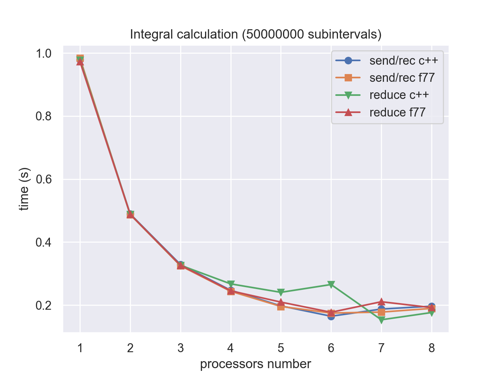
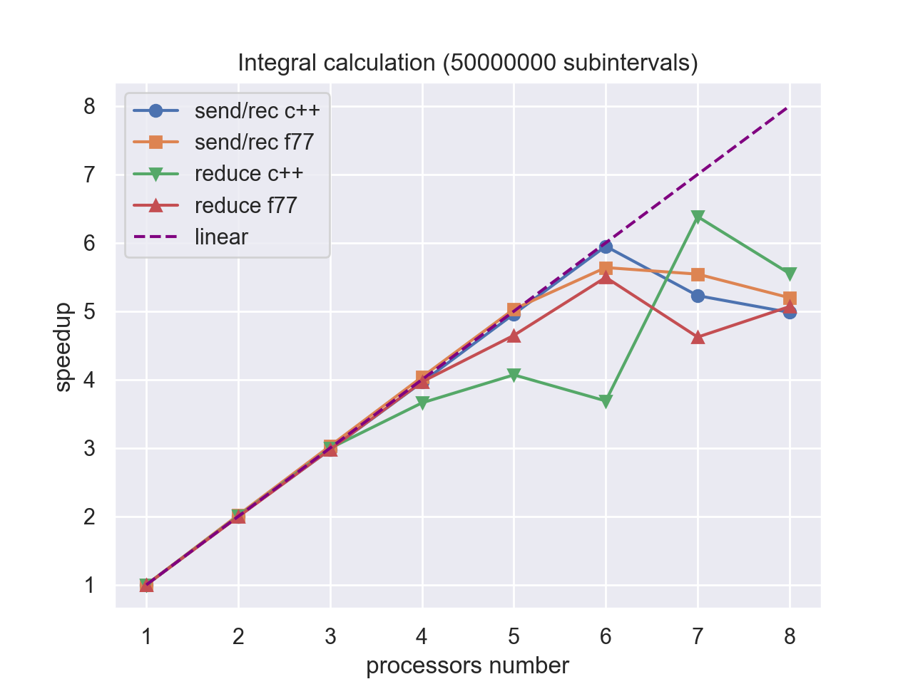
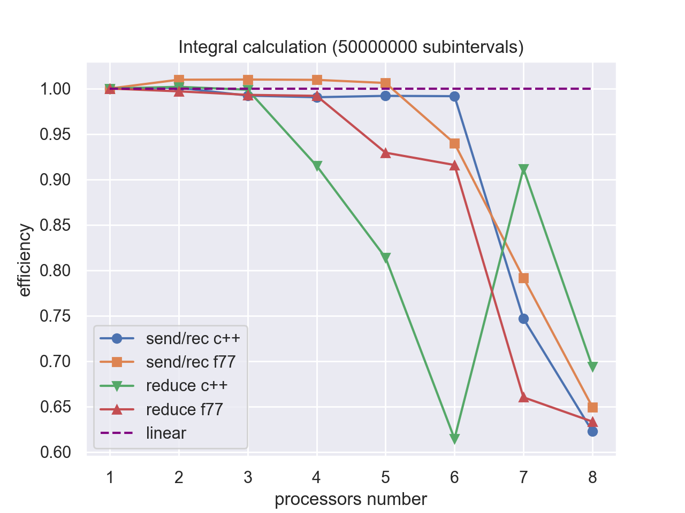
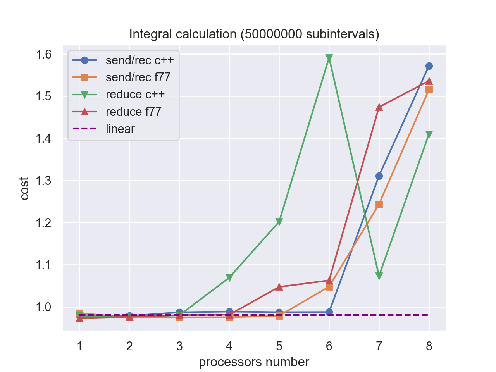

# MPI-OpenMP-examples
## Overview
C++ and FORTRAN MPI examples with **time**, **speedup**, **cost** and **efficiency** analysis for different numbers of processes involved.

## Details
There are 3 examples, each consists of several different approaches for same problem.

#### Example 1
Calculate defenite integral over 1 variable, using methods of rectangles. There are 4 different implementations:  
- using C++ and MPI_SEND() and MPI_RECEIVE() functions
- using FORTRAN77 and MPI_SEND() and MPI_RECEIVE() functions
- using C++ and MPI_REDUCE() function
- using FORTRAN77 and MPI_REDUCE() function

#### Example 2
Calculate integral over 5 variables. The next 2 approaches are used and compared:
- methods of rectangles
- Monte Carlo method

#### Example 3
OpenMP in C++ and FORTRAN77 is used in this example to perform 2 tasks:
- _Pi_ calculation
- 2 random rectangular matrices multiplication

## Performance analysis
Each of examples above is analysed for time of execution, speedup, cost and efficiency for number of processes in interval [1..8] .
After that results are plotted in Python with matplotlib and seaborn and compared to "ideal" linear speedup.

## Usage
It is assumed that you have C++ and FORTRAN compilers as well as Python and IPython with required libraries.
clone  
run bash script to install mpi dependencies  
launch ipython notebook

## Results 
  
  

## Used software and hardware
Tests are performed on machine with following specifications:  
**Processor**: 8 cores Intel(R) Xeon(R) CPU E5-2620 0 @ 2.00GHz, cache size 16 MB  
**RAM**: 8 GB

## Author
Viacheslav Zhenylenko
